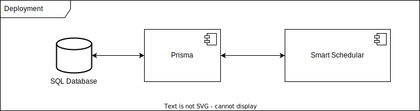

# Willkommen bei SmartSchedular!

Diese Repository dient als die Code-Basis für die Entwicklung von SmartSchedular. SmartSchedular ist ein Tool, das die Erstellung von Stundenplänen für Schüler und Lehrer erleichtert. Es bietet eine einfache und intuitive Benutzeroberfläche, die es ermöglicht, Stundenpläne zu erstellen, zu bearbeiten und zu verwalten.

## Projekt Aufsetzen

Bevor die Packages installiert werden können muss eine `.npmrc` Datei im root Verzeichnis des Projektes anglgt werden, in der die npm Registry von Hitabis configuriert werden muss.
Ohne die Registry lässt sich `@oaklean/cli` und `@oaklean/profiler-jest-environment` nicht installieren.

Nach dem Configurieren der Registry könnnen die Packages mit

```bash
npm install
# oder
pnpm install
```

installiert werden.

## Anwendung starten

Zuerst sollte eine `.env` Datei mit den, wie in [.env.example](.env.example) beschrieben, Umgebungsvariablen angelegt werden.

Danach kann der Entwicklungsserver gestartet werden:

```bash
npm run dev
# oder
pnpm dev
```

[http://localhost:3000](http://localhost:3000) sollte in deinem Browser geöffnet werden, um das Ergebnis zu sehen.

Die Seite kann bearbeitet werden, indem `app/page.tsx` modifiziert wird. Die Seite wird automatisch aktualisiert, wenn die Datei bearbeitet wird.

## Struktur des Projekts

### `src/`

- Enthält den gesamten Code deiner Anwendung.
- Die zentrale Organisation für deine App.

### `src/app/`

- **`page.tsx`**: Definiert eine Seite. Z. B. `src/app/page.tsx` ist die Startseite (`/`).
- **`layout.tsx`**: Definiert das Layout (z. B. Header, Footer) für eine Seite oder eine Gruppe von Seiten.
- **Unterseiten**: Erstelle Unterverzeichnisse mit einer eigenen `page.tsx`, um neue Routen hinzuzufügen (z. B. `src/app/unterseite/page.tsx` wird `/unterseite`).

### `src/components/`

- Enthält wiederverwendbare Komponenten (z. B. Buttons, Header).

### `src/styles/`

- Hier können CSS-Dateien oder CSS-Module abgelegt werden.

### `public/`

- Statische Dateien wie Bilder oder Icons. Inhalte sind direkt über die URL zugänglich.
  - Beispiel: `public/images/logo.png` ist unter `http://localhost:3000/images/logo.png` erreichbar.

### `next.config.js`

- Konfigurationsdatei für dein Projekt (z. B. benutzerdefinierte Routen oder Umgebungsvariablen).
-

### `drizzle.config.js`

- Konfigurationsdatei für Drizzle

### `.example.env`

- Konfigurationsdatei für Secrets und Datenbankverbindungen
  Die [`.env.example`](.env.example) sollte kopiert und in `.env.local` umbenannt werden für die lokale Entwicklung.

## ✏️ Neue Seite hinzufügen

### 1. Neue Seite erstellen:

- Erstelle die Datei `src/app/neue-seite/page.tsx`:
  ```tsx
  export default function NeueSeite() {
    return <h1>Willkommen auf der neuen Seite!</h1>;
  }
  ```

## Abhängigkeiten und Versionsnummern

Die Abhängigkeiten und Versionsnummern sind in der `package.json` Datei definiert:

```json
{
  "dependencies": {
    "react": "^18",
    "react-dom": "^18",
    "next": "14.2.18"
  },
  "devDependencies": {
    "typescript": "^5",
    "@types/node": "^20",
    "@types/react": "^18",
    "@types/react-dom": "^18",
    "postcss": "^8",
    "tailwindcss": "^3.4.1",
    "eslint": "^8",
    "eslint-config-next": "14.2.18"
  }
}
```

## Mehr über Next erfahren

Um mehr über Next.js zu erfahren, sollten die folgenden Ressourcen angesehen werden:

- [Next.js Dokumentation](https://nextjs.org/docs) - mehr über die Funktionen und die API von Next.js lernen.
- [Lerne Next.js](https://nextjs.org/learn) - ein interaktives Next.js Tutorial.

## ShadCN Komponenten hinzufügen

ShadCN bietet eine Reihe von Komponenten, die in dein Projekt eingefügt werden können. Die Komponenten können mit dem folgenden Befehl hinzugefügt werden:

```bash
npx shadcn add <gewünschte Komponente>
```

## Testing mit Jest

Jest ist ein Test-Framework, das in Next.js integriert ist. Es kann verwendet werden, um Tests für deine Anwendung zu schreiben.

```bash
npm run test
# oder
pnpm test
```

Die Tests können in der `__tests__` Verzeichnis innerhalb des Projekts geschrieben werden. Weitere Informationen finden sich in der [Jest Dokumentation](https://jestjs.io/docs/getting-started).

## Linting mit ESLint

ESLint ist ein Linter für JavaScript und TypeScript. Es kann verwendet werden, um Code-Standards zu überprüfen und Fehler im Code zu finden.

```bash
npm run lint
# oder
pnpm lint
```

Die Regeln für ESLint können in der `.eslintrc.js` Datei konfiguriert werden. Weitere Informationen finden sich in der [ESLint Dokumentation](https://eslint.org/docs/user-guide/getting-started).

## Styling mit Tailwind CSS

Tailwind CSS ist ein Utility-First CSS-Framework, das in Next.js integriert ist. Es kann verwendet werden, um schnell und einfach benutzerdefinierte Styles für deine Anwendung zu erstellen.

Die Styles können in der `src/styles` Verzeichnis innerhalb des Projekts geschrieben werden. Weitere Informationen finden sich in der [Tailwind CSS Dokumentation](https://tailwindcss.com/docs).

## Testen der Anwendung mit Cypress

Cypress ist ein End-to-End-Test-Framework, das in Next.js integriert ist. Es kann verwendet werden, um Tests für deine Anwendung zu schreiben.

```bash
npm run cypress:open
# oder
pnpm cypress:open
```

Die Tests können in der `cypress/integration` Verzeichnis innerhalb des Projekts geschrieben werden. Weitere Informationen finden sich in der [Cypress Dokumentation](https://docs.cypress.io/guides/overview/why-cypress).

## Code formatieren mit Prettier

Prettier ist ein Code-Formatter, der in Next.js integriert ist. Er kann verwendet werden, um den Code automatisch zu formatieren.

```bash
npm run format
# oder
pnpm format
```

Die Regeln für Prettier können in der `.prettierrc` Datei konfiguriert werden. Weitere Informationen finden sich in der [Prettier Dokumentation](https://prettier.io/docs/en/index.html).


## Schema erstellen und deployen mit Drizzle

Um das Datenbank Schema anzupassen [schema.ts](src/db/schema.ts) bearbeiten. Im Anschluss können die Änderungen mit `npm run db` in die Datenbank gepushed werden.

## Architektur

### Komponenten

Das Projekt basiert auf einem modernen Tech-Stack, der schnelle Prototyp-Entwicklung und Skalierbarkeit ermöglicht:

- Frontend: React und TypeScript für eine typsichere und modulare UI.
- Backend: Next.js auf Node.js für serverseitiges Rendering und API-Integration.
- Datenbank & Authentifizierung: PostgreSQL, Drizzle (ORM) und NextAuth.js für sichere Datenverwaltung und Authentifizierung.


_Komponentendiagramm_

### Deployment

Die Anwendung wird auf einer VPS in Docker Containern deployed werden und über Traefik als Reverse Proxy im Internet erreichbar sein.

_Deploymentdiagramm_

## Infrastruktur

### Zugang zu Hitabis VM

Zugangsdaten befinden sich in Confluence. Wir haben keine Sudo-Rechte auf dem Server.

### Docker Registry

Ein Harbor Docker Registry (harbor.hitabis.de/htw) wurde uns von Hitabis zur Verfügung gestellt. Potenzielle Docker Images können beispielsweise mit dem `harbor.hitabis.de/htw/schedular:production` Tag gepushed werden.
Die Zugangsdaten dafür liegen auf der VM unter `/home/htw/harbor-registry-hitabis.txt`.

### Reverse Proxy

Für die Verbinding ins Internet mit einem gültigen SSL-Zertifikat sollen wir `Traefik` nutzen, ein Container, sowie ein [Template](docker-compose.yml) wurde uns zur Verfügung gestellt.

## Oaklean

[Oaklen](https://github.com/hitabisgmbh/oaklean) ist ein Software-Tool, welches hift die Performance von Software zu Visualliseren und zu optimieren.

### Konfiguration

Im Projekt eingechecked ist die Konfiguation für MacOS.
Damit Oaklean auf Windows oder Linux läuf muss die `.oaklean` Datei mir `npx oak init` neu generiert werden.

Der Profiler für die live Applikation läuft 30 Sekunden. Dise Zeit ist in der [Instrumentsation](./src/instrumentation.ts) Datei definiert.

Für eine Energiemessung auf MacOS muss der Test mit root Rechte ausgeführt werden.

### Testen

Die Tests können mit

```shell
npm run test:measure
```

geporfiled werden.

Um die Anwendung zu profilen muss diese zunächst gebaut werden und im prod Modus gestartet werden.

```shell
npm run build
npm run start
```

Hinweis: Das Profiling der Applikation im Dev modus ist nicht sinnvoll.

Die Messergebnisse können in dem [profiles](./profiles) Ordner gefunden werden und mit der [Oaklean Extension](https://marketplace.visualstudio.com/items?itemName=HitabisGmbH.oaklean) in VSCode analysiert werden.
